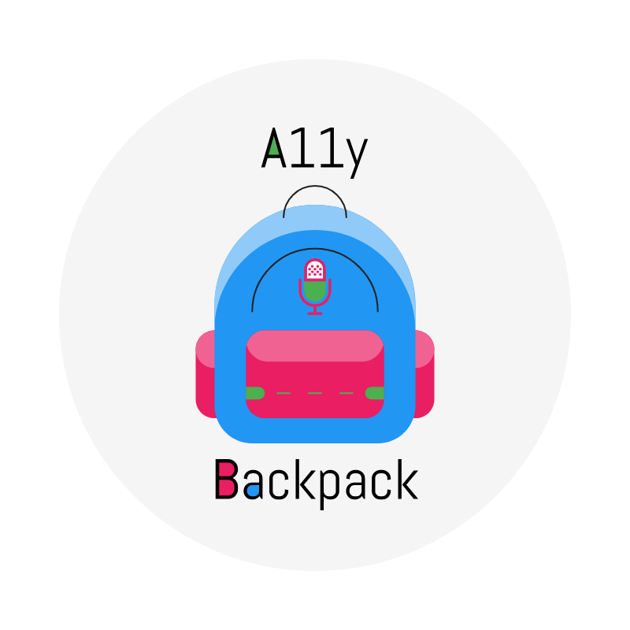

<p align="center">
  
</p>

[](https://coveralls.io/github/jppianta/a11y-backpack?branch=master)

A11y Backpack is a service designed to improve accessibility on your website. Easily allow the user to navigate and read content using keyboard and voice commands.

## Example

```javascript
  a11yBackpack.setStartListeningKey('l');

  a11yBackpack.setReadOnElementCommand({ id: 'main-text', commandKey: 'c', voiceWord: 'content' });

  a11yBackpack.setClickOnElementCommand({ id: 'menu-home-link', commandKey: 'h', voiceWord: 'home' });
```

`a11yBackpack.setStartListeningKey('l')`: Starts recognizing voice commands when the `l` key is pressed.

`a11yBackpack.setReadOnElementCommand({ id: 'main-text', commandKey: 'c', voiceWord: 'content' })`: Reads the content of element with id `main-text` when the key `c` is pressed or when the usar says `content`.

`a11yBackpack.setClickOnElementCommand({ id: 'menu-home-link', commandKey: 'h', voiceWord: 'home' })`: Clicks the element with id `menu-home-link` when the key `h` is pressed or when the usar says `home`.